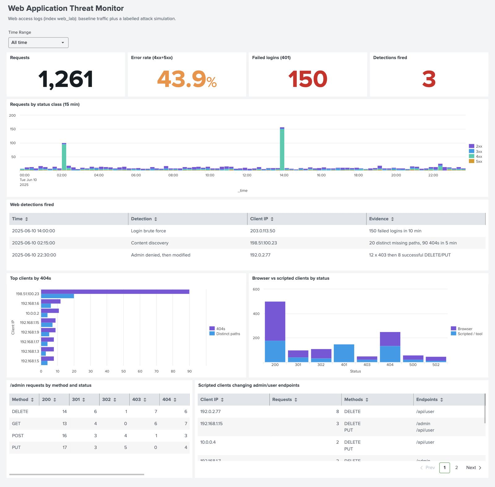
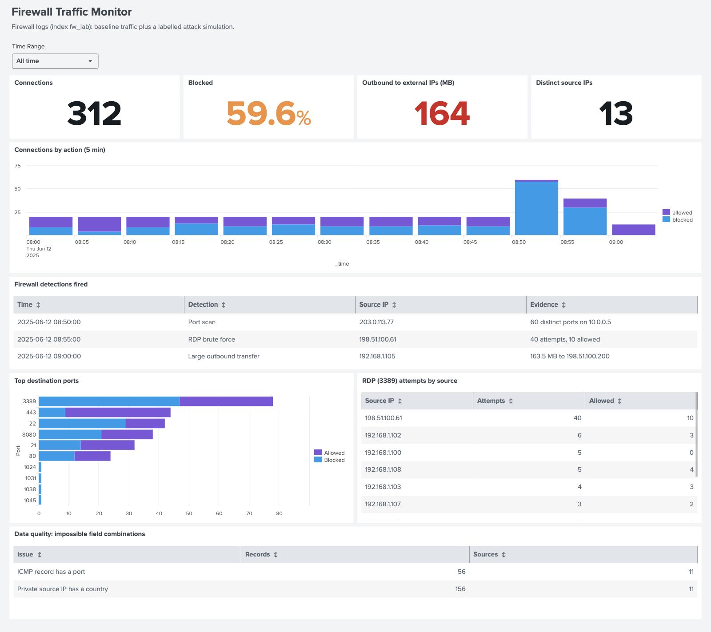
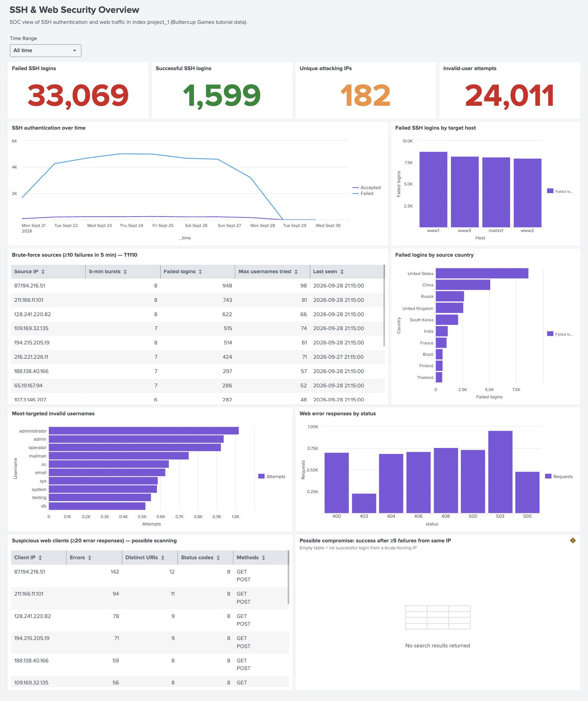

# Splunk Security Monitoring

Threat detection and SOC dashboards built in Splunk Cloud. The project covers SSH, web and firewall logs, with detections mapped to MITRE ATT&CK and tested against a labelled attack simulation.

## Highlights

- **3 Dashboard Studio dashboards** for SSH, web application and firewall monitoring
- **11 detection searches** mapped to MITRE ATT&CK, plus 2 threat-hunting searches and a data-quality check
- **Every threshold based on measured normal traffic**, not guesswork
- **Tested with a reproducible attack simulation**: all 6 simulated attacks detected with 0 false positives on 1,200 normal events
- **Scheduled alerts** with per-attacker throttling and severity ratings

## Dashboards

### Web Application Threat Monitor

Traffic by status class, detections that fired, top 404 clients, browser vs scripted clients, and `/admin` access.



### Firewall Traffic Monitor

Allowed vs blocked traffic, detections that fired, top destination ports, RDP sources and a data-quality check.



### SSH & Web Security Overview

SSH brute-force activity across four servers: failed vs successful logins, attacking IPs and countries, targeted usernames, and web scanners.



The dashboard source files are in [`dashboards/`](dashboards). To import one, open Splunk and go to **Dashboards → Create New Dashboard → Dashboard Studio**, then paste the JSON into the source editor.

## Detections

### Linux (SSH)

| Detection | MITRE ATT&CK | Result |
|---|---|---|
| [SSH brute force](searches/detections/linux/ssh_brute_force.spl) | T1110.001 | Top source made 948 failed attempts |
| [SSH login after repeated failures](searches/detections/linux/ssh_login_after_failures.spl) | T1110, T1078 | No hits: no attacker got in |

### Web

| Detection | MITRE ATT&CK | Result |
|---|---|---|
| [Error-based scanning](searches/detections/web/error_based_scanning.spl) | T1595 | Top scanner: 142 errors across 12 URLs |
| [Login brute force](searches/detections/web/login_brute_force.spl) | T1110.001 | Caught the simulated attack, 0 false positives |
| [404 spike](searches/detections/web/404_spike.spl) | T1595.003 | Caught the simulated attack, 0 false positives |
| [Content discovery](searches/detections/web/content_discovery.spl) | T1595.003, T1083 | Caught the simulated attack, 0 false positives |
| [Admin denied, then modified](searches/detections/web/admin_denied_then_modified.spl) | T1078, T1485 | Caught the simulated attack, 0 false positives |

### Network (firewall)

| Detection | MITRE ATT&CK | Result |
|---|---|---|
| [Port scan](searches/detections/network/port_scan.spl) | T1046 | Caught the simulated attack, 0 false positives |
| [RDP brute force](searches/detections/network/rdp_brute_force.spl) | T1110, T1021.001 | Caught the simulated attack, 0 false positives |
| [Large outbound transfer](searches/detections/network/large_outbound_transfer.spl) | T1041, T1048 | Caught the simulated attack, 0 false positives |

### Windows

| Detection | MITRE ATT&CK | Result |
|---|---|---|
| [Failed logon burst](searches/detections/windows/failed_logon_burst.spl) | T1110 | Written; no Windows data loaded yet |

### Hunting and data quality

| Search | Purpose |
|---|---|
| [SSH and web attacks from the same source](searches/hunting/ssh_and_web_same_source.spl) | Finds IPs attacking both services (152 found) |
| [Scripted clients changing admin endpoints](searches/hunting/scripted_admin_changes.spl) | Finds curl/Postman requests that change data on `/admin` or `/api/user` |
| [Firewall field integrity](searches/data-quality/firewall_field_integrity.spl) | Flags impossible records, such as ICMP traffic with a port number |

Scheduled versions of the web and network detections are in [`alerts/savedsearches.conf`](alerts/savedsearches.conf).

## Key findings

**SSH and web** ([full write-up](docs/findings-ssh-web.md))

- 33,069 failed SSH logins from 182 IPs; 73% of them tried usernames that don't exist.
- No attacking IP ever logged in successfully.
- 152 IPs attacked both SSH and the web servers.

**Web and firewall lab** ([full write-up](docs/findings-web-firewall-lab.md))

- All 6 simulated attacks were detected, with no false positives.
- In the original data, scripts successfully ran 19 DELETE/PUT requests against admin endpoints.
- RDP was allowed from 9 internal sources.
- The firewall log contains 56 records that can't be real (ICMP with a port number).

## Data

| Index | Sourcetype | Events | Content |
|---|---|---|---|
| `project_1` | `secure-2` | ~40,000 | Linux SSH logs from 4 servers |
| `project_1` | `access_combined_wcookie` | ~39,500 | Apache web access logs |
| `web_lab` | `web:access` | 1,000 + 261 simulated | [`sample-data/complex_log.csv`](sample-data/complex_log.csv) |
| `fw_lab` | `fw:traffic` | 200 + 112 simulated | [`sample-data/firewall_traffic_logs_large.csv`](sample-data/firewall_traffic_logs_large.csv) |

`project_1` holds Splunk's tutorial dataset (a fictional online game store). The two lab datasets are synthetic and contain no real attacks, so I added a labelled attack simulation to test the detections against.

## Attack simulation

Six attack scenarios are generated deterministically, so every run produces the same events:

| Scenario | Technique |
|---|---|
| Web login brute force | 150 failed logins in 10 minutes, then a success |
| Content discovery scan | Nikto probing 20 missing paths |
| Admin abuse | Denied on `/admin`, then successful deletes with curl |
| Port scan | 60 ports on one host in 60 seconds |
| RDP brute force | 40 attempts in 4 minutes, 10 allowed |
| Data exfiltration | 163.5 MB to one external IP in 3 minutes |

Attacker IPs come from reserved documentation ranges (RFC 5737). Every simulated event is tagged with a `scenario` field so it can be filtered out. The Python and SPL generators produce identical output. Details: [`simulation/README.md`](simulation/README.md)

## Repository layout

```
.
├── alerts/            Scheduled alert and report definitions
├── configs/           Forwarder inputs and field extractions
├── dashboards/        Dashboard Studio JSON exports
├── docs/              Setup guide and findings
├── sample-data/       Lab datasets and simulated attack events
├── screenshots/       Dashboard screenshots
├── searches/
│   ├── detections/    linux/, web/, network/, windows/
│   ├── hunting/       Threat-hunting searches
│   └── data-quality/  Log integrity checks
└── simulation/        Attack simulation (Python and SPL)
```

## Running it yourself

1. Create a Splunk Cloud trial or install Splunk Enterprise.
2. Create the indexes `web_lab` and `fw_lab`.
3. Load the CSVs from `sample-data/` and the simulated events, following [`simulation/README.md`](simulation/README.md).
4. Import the dashboards from `dashboards/`.
5. Run any search in `searches/` from Search & Reporting, with the time range set to **All time**.

Setup notes for forwarders and the tutorial data are in [`docs/setup.md`](docs/setup.md).

## Tools

Splunk Cloud · SPL · Dashboard Studio · Python · MITRE ATT&CK

## Author

Shrihari V · [@Shrihari6105](https://github.com/Shrihari6105)
